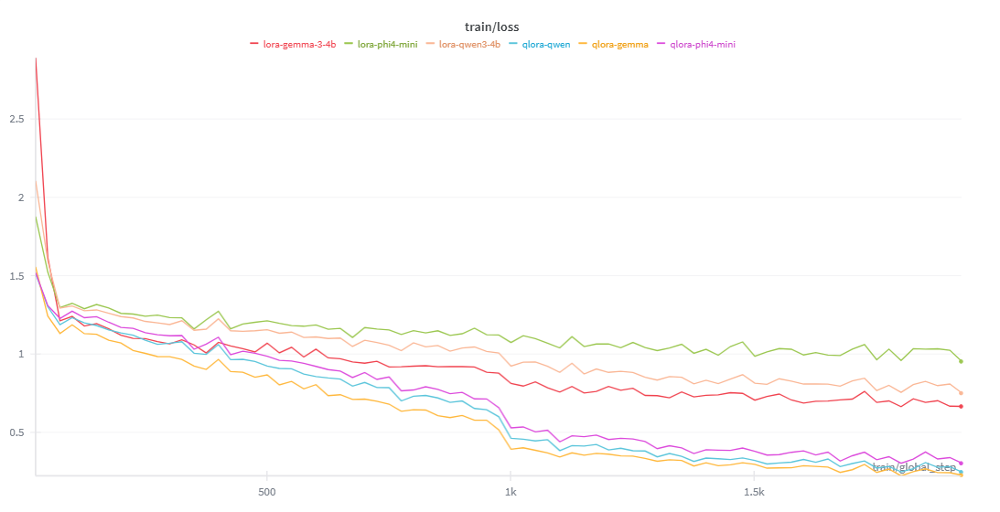
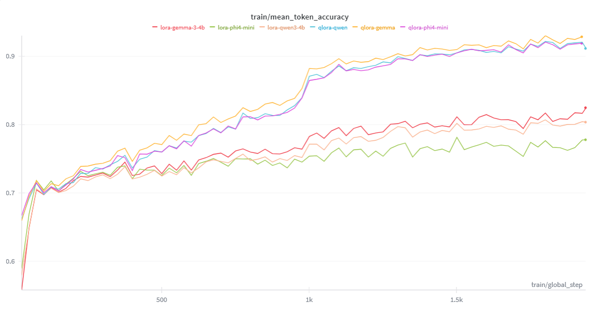
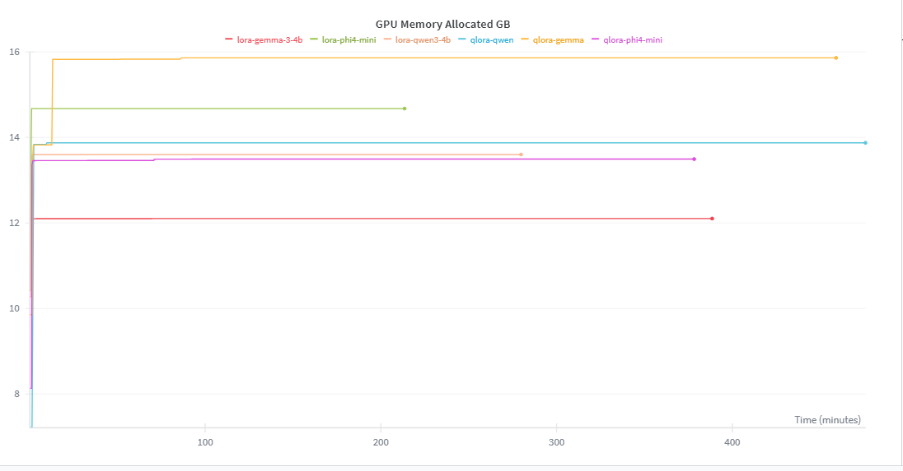

# ⚖️ Nyaya-LLM: Legal Domain Adaptation & Reasoning Ablation Study

An end-to-end Machine Learning pipeline designed to adapt 4B-parameter Large Language Models (Qwen-2.5, Gemma-3, Phi-4) to the Indian Legal Domain.

This project is structured as a rigorous two-phase ablation study to benchmark **Statute Memorization (Phase 1)** against **Synthetically Augmented Legal Reasoning (Phase 2)**.

## 🚀 Executive Summary

* **LLM Ablation Study:** Conducted a comprehensive comparative analysis between **LoRA** and **QLoRA** adapters across multiple state-of-the-art 4B models.
* **Automated Evaluation:** Engineered an offline "LLM-as-a-Judge" pipeline utilizing a 4-bit quantized Qwen2.5-7B model with dynamic adapter swapping to manage VRAM constraints.
* **Memory Optimization:** Successfully stabilized mixed-precision training and inference on legacy 16GB GPUs, resolving catastrophic `NaN` overflow errors in Gemma-3 by enforcing pure FP32 compute and custom gradient clipping.

---

## 📊 Phase 1 Results: Baseline Memorization

In Phase 1, the base models were fine-tuned strictly on raw legal statutes. The goal was to establish a baseline for rote memorization and basic act identification.

Evaluations were conducted using a strict 1-5 semantic scoring rubric scored by our local Qwen2.5-7B judge across 150 curated legal queries.

| Model | Adapter | Overall Avg (Out of 5) | Act Identification | Direct Q&A |
| --- | --- | --- | --- | --- |
| **Qwen-2.5 (4B)** | **QLoRA** | **2.65 🏆** | **4.77** | 1.35 |
| Gemma-3 (4B) | QLoRA | 2.57 | 4.59 | 1.16 |
| Phi4:Mini (4B) | QLoRA | 2.48 | 4.46 | 1.23 |
| Qwen-2.5 (4B) | LoRA | 2.36 | 3.95 | 1.13 |
| Gemma-3 (4B) | LoRA | 2.35 | 3.97 | 1.23 |
| Phi4:Mini (4B) | LoRA | 2.32 | 3.92 | 1.13 |

### 💡 Phase 1 Analysis & The "Reasoning Gap"

The data clearly demonstrates the limitations of standard supervised fine-tuning on raw text. While the best model (Qwen-2.5 QLoRA) achieved near-perfect scores (**4.77/5.0**) on **Act Identification** (memorization), it failed drastically (**1.35/5.0**) on **Direct Q&A** tasks that require synthesis.

**Conclusion:** Rote memorization of statutes does not inherently teach an LLM legal reasoning. This perfectly justifies **Phase 2**, which introduces a custom synthetic data pipeline designed to bridge this reasoning gap.

---

## 🛠️ Engineering Challenges Overcome

### 1. Stabilizing Gemma-3 (The `NaN` Overflow Bug)

**Problem:** During both standard LoRA training and evaluation, Gemma-3 models consistently crashed the PyTorch `multinomial` sampler with `device-side assert` errors due to probability tensors containing `NaN` or `inf`.
**Solution:** Diagnosed the issue as an activation overflow inherent to Gemma's architecture when restricted to 16-bit precision. Engineered a dynamic precision-routing fix:

* Maintained VRAM efficiency by loading base weights in 4-bit (`nf4`).
* Forced the computation environment to pure `torch.float32` (`bnb_4bit_compute_dtype=torch.float32`), providing the adapter a mathematical runway large enough to process Gemma's massive internal values without overflowing.

### 2. VRAM-Optimized "LLM-as-a-Judge" Pipeline

**Problem:** Running a 4B parameter candidate model and a 7B parameter Judge model simultaneously on a single 16GB GPU results in immediate Out-Of-Memory (OOM) failures.
**Solution:** Architected a dynamic VRAM management loop. The script loads the base model once, injects the LoRA adapter, generates the candidate answers, unloads the adapter (`model.unload()`), and dynamically flushes the GPU cache before spinning up the Judge pipeline.

---

## 📈 Training Telemetry & Optimization

All fine-tuning runs were rigorously profiled using **Weights & Biases (W&B)** to track model convergence and hardware efficiency. The ablation study required carefully balancing context windows and batch sizes to prevent Out-Of-Memory (OOM) failures on 16GB accelerators.

### 1. Proof of Learning (Convergence)
The models successfully adapted to the highly complex syntax of Indian Legal text without catastrophic forgetting. 
* **Training Loss:** Demonstrates stable convergence across all three 4B parameter models over 1,500+ steps. Qwen-2.5 (QLoRA) exhibited the smoothest descent, directly correlating with its superior evaluation scores.
* **Mean Token Accuracy:** Validates that the models actively learned the underlying legal structures and domain-specific vocabulary rather than just memorizing noise.

<p align="center">
  
  
</p>

### 2. Proof of Hardware Optimization (VRAM Management)
Fine-tuning a 4-Billion parameter model typically requires massive infrastructure. 
* **GPU Memory Allocation:** Visual proof of our VRAM optimization strategy. By leveraging 4-bit `nf4` quantization alongside strict batch control, peak GPU memory utilization was strictly capped well below the 16 GB hardware limit. This ensures the training pipeline is highly reproducible on accessible, low-cost cloud GPUs (like Kaggle P100s).

<p align="center">
  
</p>


---

## ⏳ Phase 2 (In Progress): Synthetic Reasoning Augmentation

To solve the poor Q&A performance identified in Phase 1, Phase 2 implements an automated data augmentation pipeline:

* **LLM Data Generation:** Using Qwen2.5-7B to generate 7,000+ complex, reasoning-based QA pairs from the raw statutes.
* **Fault-Tolerant Guardrails:** Implementing dynamic text chunking, strict JSON schema validation with automated retries, and lexical-overlap hallucination guards.
* **Checkpointing:** State-saving logic to bypass 12-hour cloud compute timeouts without data loss.

---

<!-- ## 💻 Local Inference & Usage

**1. Clone the repository and install dependencies:**

```bash
git clone https://github.com/Your-Username/Nyaya-LLM.git
cd Nyaya-LLM
pip install -r requirements.txt

```

**2. Load the Best Phase 1 Model (Qwen-2.5 4B QLoRA):**

```python
import torch
from peft import PeftModel
from transformers import AutoTokenizer, AutoModelForCausalLM, BitsAndBytesConfig

# 1. Load Base Model in 4-bit
bnb_config = BitsAndBytesConfig(
    load_in_4bit=True,
    bnb_4bit_compute_dtype=torch.float16
)

base_model = AutoModelForCausalLM.from_pretrained(
    "Qwen/Qwen2.5-4B-Instruct",
    quantization_config=bnb_config,
    device_map="auto"
)
tokenizer = AutoTokenizer.from_pretrained("Qwen/Qwen2.5-4B-Instruct")

# 2. Attach the Nyaya-LLM Adapter
model = PeftModel.from_pretrained(base_model, "nyaya-adapters/qlora_phase1_qwen3_4b")

# 3. Generate Legal Insight
prompt = "### Instruction:\nUnder which Act does Section 221 fall?\n\n### Response:\n"
inputs = tokenizer(prompt, return_tensors="pt").to("cuda")
outputs = model.generate(**inputs, max_new_tokens=100)
print(tokenizer.decode(outputs[0], skip_special_tokens=True))

``` -->