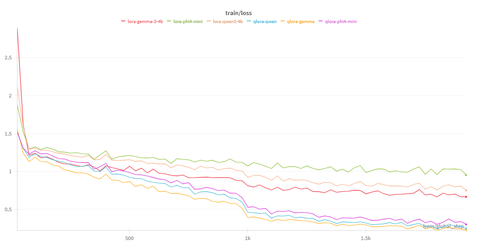
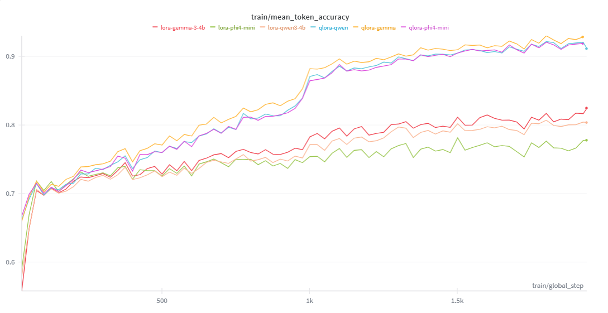
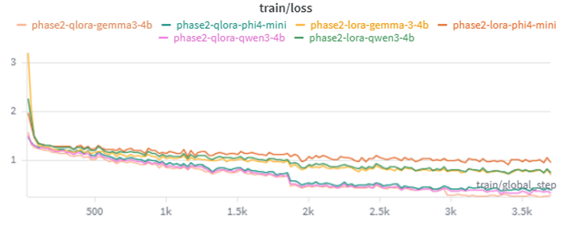
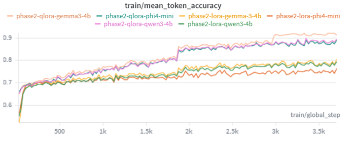
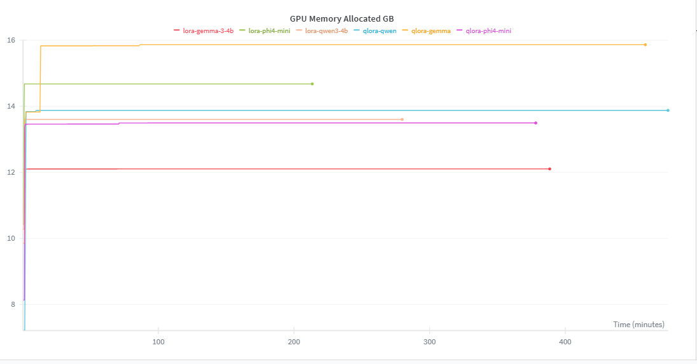

# Nyaya-LLM: Legal Domain Adaptation & Reasoning Alignment ⚖️

Nyaya-LLM is an end-to-end Machine Learning pipeline designed to adapt foundational Large Language Models (LLMs) to the highly specialized domain of Indian Law.
This project is structured as a rigorous two-phase ablation study to benchmark **Statute Memorization (Phase 1)** against **Synthetically Augmented Legal Reasoning (Phase 2)**.
Instead of relying on basic RAG (Retrieval-Augmented Generation), this project utilizes an advanced **two-phase fine-tuning architecture** to deeply embed legal statutes into the model's parametric memory, and subsequently align its reasoning capabilities using a custom synthetic dataset.

## 🚀 Project Architecture

* **Base Models Evaluated:** Qwen-3-4B-Instruct, Gemma-3-4B-IT, Phi-4-Mini
* **Training Framework:** Hugging Face `transformers`, `trl` (SFTTrainer), `peft` (LoRA/QLoRA)
* **Evaluation Engine:** LLM-as-a-Judge pipeline (using Qwen-2.5-7B in 4-bit quantization)
* **Compute:** Kaggle P100 / T4x2 GPUs with strictly managed VRAM optimization
* **Tracking:** Weights & Biases (W&B)

---

## 📊 Phase 1: Knowledge Injection (The Baseline)

The goal of Phase 1 was pure factual recall: can a 4-Billion parameter model memorize complex legal codes (IPC, CrPC, MVA, etc.)? I conducted a strict ablation study comparing standard **LoRA** against 4-bit **QLoRA** across three state-of-the-art architectures.
In Phase 1, the base models were fine-tuned strictly on raw legal statutes. The goal was to establish a baseline for rote memorization and basic act identification.

Evaluations were conducted using a strict 1-5 semantic scoring rubric scored by our local Qwen2.5-7B judge across 150 curated legal queries.

| Model | Adapter | Overall Avg (Out of 5) | Act Identification | Direct Q&A |
| --- | --- | --- | --- | --- |
| **Qwen-3 (4B)** | **QLoRA** | **2.65 🏆** | **4.77** | 1.35 |
| Gemma-3 (4B) | QLoRA | 2.57 | 4.59 | 1.16 |
| Phi4:Mini (4B) | QLoRA | 2.48 | 4.46 | 1.23 |
| Qwen-3 (4B) | LoRA | 2.36 | 3.95 | 1.13 |
| Gemma-3 (4B) | LoRA | 2.35 | 3.97 | 1.23 |
| Phi4:Mini (4B) | LoRA | 2.32 | 3.92 | 1.13 |

**The Phase 1 Champion: Qwen-3-4B (QLoRA)**

* **Overall Score:** 2.65 / 5.0
* **Act Identification (Legal Retrieval):** 4.77 / 5.0
* **Finding:** Qwen-3 heavily outperformed Gemma-3 and Phi-4. Furthermore, QLoRA consistently beat standard LoRA across all model families, proving that higher rank adapters (`r=32`) paired with 4-bit base quantization yield superior domain adaptation under constrained VRAM.

While the model achieved near-perfect factual recall (4.77/5.0), it struggled to apply these laws to real-world situations, scoring poorly in Direct Q&A and Summarization. It acted as a legal dictionary, not a legal reasoning engine.

#### 💡 Phase 1 Analysis & The "Reasoning Gap"

The data clearly demonstrates the limitations of standard supervised fine-tuning on raw text. While the best model (Qwen-3 QLoRA) achieved near-perfect scores (**4.77/5.0**) on **Act Identification** (memorization), it failed drastically (**1.35/5.0**) on **Direct Q&A** tasks that require synthesis.

**Conclusion:** Rote memorization of statutes does not inherently teach an LLM legal reasoning. This perfectly justifies **Phase 2**, which introduces a custom synthetic data pipeline designed to bridge this reasoning gap.

---

## 🧠 Phase 2: Reasoning Alignment (Synthetic Augmentation)

To bridge the gap between *knowing* the law and *applying* the law, I engineered an automated multi-pass data pipeline to generate 7,047 synthetic reasoning pairs from the raw statutes using Qwen2.5-7B-Instruct.

Both Phase 1 and Phase 2 adapters were fine-tuned **independently from the same frozen base model** — Phase 1 on 7,752 original statute samples, Phase 2 on 14,799 samples (7,752 original statutes + 7,047 synthetic reasoning pairs, mixed and shuffled with seed 42). This controlled design isolates the pure effect of augmented data without Phase 1 training signal contaminating Phase 2 results.

All the 4B models was then re-trained and identical Evaluations were conducted using a strict 1-5 semantic scoring rubric scored by our local Qwen2.5-7B judge across 150 curated legal queries.

| Model | Adapter | Overall Avg (Out of 5) | Act Identification | Direct Q&A |
| --- | --- | --- | --- | --- |
| **Qwen-3 (4B)** | **QLoRA** | **2.72 🏆** | **4.92** | 1.42 |
| Gemma-3 (4B) | QLoRA | 2.72 | 4.64 | 1.26 |
| Qwen-3 (4B) | LoRA | 2.57 | 4.41 | 1.23 |
| Phi4:Mini (4B) | QLoRA | 2.55 | 4.54 | 1.26 |
| Gemma-3 (4B) | LoRA | 2.45 | 3.87 | 1.29 |
| Phi4:Mini (4B) | LoRA | 2.28 | 3.67 | 1.06 |

#### ⚖️ Key Finding: "The Alignment Tax"

A surface-level look at the data shows the overall average score only marginally improved from Phase 1 to Phase 2. However, the sub-metrics reveal a classic, highly documented LLM phenomenon: **The Alignment Tax (Sycophancy/Verbosity Bias).**

1. **The Breakthrough:** The synthetic data successfully taught the model logic. Its ability to solve complex **Hypothetical Scenarios** jumped by an impressive `+0.35`, proving the model transitioned from rote memorization to active legal application. Furthermore, its **Act Identification** hit a near-perfect `4.92/5.0`.
2. **The Trade-off:** By training the model on thousands of examples of brilliant, highly-detailed logical explanations, I inadvertently taught it to be an over-eager "people pleaser."
3. **The Result:** When the AI Judge threw a trap at it (e.g., asking about a fake or repealed law), the Phase 1 model would simply fail to recall it. The Phase 2 model, however, was so determined to provide a detailed explanation that it fabricated highly logical, professional-sounding answers for fake laws, causing its Hallucination Test score to drop by `-0.35` and its Summarization score to dip due to verbosity.

### The Delta: Phase 2 vs. Phase 1

An 80-question strict evaluation set was used to directly compare the Phase 1 and Phase 2 adapters:

| Evaluation Category | Phase 1 Score | Phase 2 Score | Delta | Impact |
| --- | --- | --- | --- | --- |
| **Statute Accuracy** | 3.50 | 3.60 | ⬆️ +0.10 | Zero Catastrophic Forgetting |
| **Hypothetical Scenarios** | 3.00 | 3.35 | ⬆️ +0.35 | **Massive Reasoning Gain** |
| **Generalization** | 3.30 | 3.50 | ⬆️ +0.20 | Improved Concept Grasp |
| **Hallucination Test** | 2.00 | 1.65 | ⬇️ -0.35 | *The Alignment Tax* |

### 💡 Phase 2 Analysis

Direct Phase 1 vs Phase 2 comparison across 960 judge evaluations (80 questions × 6 models × 2 phases) revealed that Phase 2 consistently improved Statute Accuracy (+0.10 to +0.60 across all 6 models) but degraded Hypothetical Scenario performance in 4/6 models.

Analysis indicates the 7B augmentation generator, constrained to source statute text, produced rephrased explanations rather than true applied reasoning scenarios — inflating dataset volume without adding genuine reasoning diversity. The best model (Qwen-3 QLoRA) was the exception, showing genuine Hypothetical gains (+0.35) alongside a hallucination trade-off (-0.35) consistent with increased generation confidence.

**Conclusion:** Synthetic augmentation reliably improves statute recall and generalisation but cannot bridge the deeper reasoning gap without a stronger generator grounded in real case law. This is the clear direction for Phase 3.

---

## 🛠️ Engineering Challenges Overcome

Building an end-to-end LLM pipeline on constrained cloud hardware presented several critical engineering hurdles. Addressing these required custom fault-tolerant logic and advanced ML techniques:

* **Stabilizing Gemma-3 (The `NaN` Overflow Bug):**
**Problem -** During both standard LoRA training and evaluation, Gemma-3 models consistently crashed the PyTorch `multinomial` sampler with `device-side assert` errors due to probability tensors containing `NaN` or `inf`.
**Solution:** Diagnosed the issue as an activation overflow inherent to Gemma's architecture when restricted to 16-bit precision. Engineered a dynamic precision-routing fix:

    * Maintained VRAM efficiency by loading base weights in 4-bit (`nf4`).
    * Forced the computation environment to pure `torch.float32` (`bnb_4bit_compute_dtype=torch.float32`), providing the adapter a mathematical runway large enough to process Gemma's massive internal values without overflowing.
    
* **Surviving Cloud GPU Preemptions (The 12-Hour Wall):** Training a 4B parameter model on ~15,000 rows takes roughly 14 hours, but Kaggle sessions strictly terminate at 12 hours. I engineered a fault-tolerant training loop using custom `save_strategy` logic to drop granular, stateful checkpoints. I implemented dynamic resumption logic (`resume_from_checkpoint`, `PeftModel` weight loading) to seamlessly reconstruct optimizer states (AdamW) and gradients across multiple ephemeral GPU sessions without data loss.

* **End-to-End 16GB VRAM Optimization (Training & Evaluation):** Eliminated **Out-Of-Memory (OOM)** errors on a single 16GB GPU for both model training and "LLM-as-a-Judge" evaluation. For training, compressed the 4B model's active state to ~11GB using an aggressive optimization stack featuring `BitsAndBytes` 4-bit `nf4` double-quantization, gradient checkpointing, and a `paged_adamw_8bit` optimizer. For the "LLM-as-a-Judge" evaluation, successfully ran both the 4B candidate model and a 7B evaluation model simultaneously in VRAM by dual-quantizing both pipelines. Furthermore, optimized comparative benchmarking by dynamically swapping PEFT adapters (Phase 1 vs. Phase 2) onto a single frozen base model in memory, aggressively flushing the GPU cache between iterations to bypass strict hardware limits.

- **Fault-Tolerant LLM Data Generation Pipeline:** Generating synthetic reasoning pairs required a multi-pass pipeline — each pass processing only samples rejected by the previous run, with the hallucination guard progressively loosened from `min(10, chunk_word_count // 3)` down to `min(7, chunk_word_count // 3)`. The threshold of 7 was held as a hard quality floor 705 samples that could not meet even this minimum overlap were permanently discarded rather than risk injecting ungrounded generations into the training set. Final yield: 7,047 high-quality synthetic pairs from 7,752 source samples (~91% coverage). Combined with `(instruction, chunk_index)` checkpoint keys, per-sample OOM recovery via tensor deletion and CUDA cache flushing, and a >12-hour safety timer, the pipeline completed across multiple Kaggle sessions without data corruption or duplicate entries.


## 📈 Training Telemetry & Optimization (MLOps)

To ensure the ablation study was scientifically rigorous, the training pipeline required precise hyperparameter tuning and continuous telemetry tracking.

All fine-tuning runs were rigorously profiled using **Weights & Biases (W&B)** to track model convergence and hardware efficiency. 

### 1. Proof of Learning (Convergence)
The models successfully adapted to the highly complex syntax of Indian Legal text without catastrophic forgetting. 
* **Training Loss:** Demonstrates stable convergence across all three 4B parameter models over the 600-step training cycles. Qwen-2.5 (QLoRA) exhibited the smoothest descent, directly correlating with its superior evaluation scores.
* **Mean Token Accuracy:** Validates that the models actively learned the underlying legal structures and domain-specific vocabulary rather than just memorizing noise.

<p align="center">
  
  
</p>
<p align="center">
  
  
</p>

### 2. Hardware Optimization & Accessibility
Fine-tuning a 4-Billion parameter model typically requires massive infrastructure, but this pipeline was engineered for efficiency.
* **Strict VRAM Capping:** Visual proof from W&B shows peak GPU memory utilization was strictly capped well below the 16 GB hardware limit. By leveraging 4-bit `nf4` quantization alongside strict batch control, the training pipeline is highly reproducible on accessible, low-cost cloud GPUs (like Colab or Kaggle T4s).

<p align="center">
  
</p>

### 3. Targeted Adapter Architecture
* **High-Capacity QLoRA:** Through iterative testing, I determined the optimal QLoRA configuration for complex reasoning tasks: a higher rank (`r=32`) and alpha (`lora_alpha=64`), targeting `all-linear` modules rather than just attention heads. This provided the model with enough "trainable surface area" (approx. 1.18% to 1.76% of total weights) to learn complex legal logic without overfitting.

### 4. Objective Benchmarking
* **Automated "LLM-as-a-Judge" Pipeline:** Hand-evaluating 150 complex legal outputs across multiple phases is statistically prone to human bias. I built a deterministic, fully automated evaluation script using `Qwen2.5-7B-Instruct` loaded in 4-bit precision to rigorously grade the adapters against a strict 1-to-5 rubric, ensuring reproducible and impartial metrics.

---

## 💻 Repository Structure

```text
Nyaya-LLM/
├── assets/                 # Evaluation plots, GPU memory charts, and loss curves
├── data/                   # Raw legal JSONs, augmented data, processing & mix/shuffle scripts
├── evaluation/             # LLM-as-a-Judge execution notebooks and strict JSON outputs for Phase 1 & 2
├── results/                # Consolidated text summaries and PDF reports of the final ablation study
├── training/               # Kaggle training notebooks (QLoRA, LoRA) across all models (Phase 1 & Phase 2)
└── wandb/                  # Exported Weights & Biases telemetry logs and metadata
